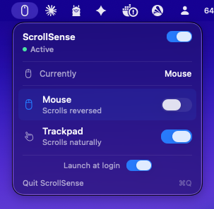

# ScrollSense

**Per-device scroll direction for macOS.**

ScrollSense keeps trackpad scrolling natural and mouse-wheel scrolling traditional,
automatically, without sending you back to System Settings every time you switch
devices.



## Why This Exists

macOS has one global **Natural Scrolling** setting. That works until you use more
than one pointing device.

Most Mac users expect:

| Device | Preferred behavior |
|--------|--------------------|
| Trackpad | Natural scrolling on |
| Mouse wheel | Natural scrolling off |

macOS treats both devices as one preference, so one of them always feels wrong.
If you use a MacBook at a desk, switch between a Magic Trackpad and a mouse, or
plug into an external setup during the day, this friction shows up constantly.

## What ScrollSense Does

ScrollSense detects the device behind each scroll event and corrects the event
before it reaches the app you are using.

- Trackpad can stay natural.
- Mouse can stay traditional.
- The menu bar shows the active device.
- Preferences are saved once and applied automatically.
- The system-wide macOS setting does not need to be toggled back and forth.

ScrollSense ships in two forms:

| Option | Best for |
|--------|----------|
| Menu-bar app | Most users. Install once, use the dropdown, no terminal needed. |
| CLI daemon | Developers, automation, Homebrew installs, LaunchAgent workflows. |

Run one at a time. The menu-bar app and CLI daemon use the same inversion engine;
if both are running, they can cancel each other out.

## Quick Start

### Menu-Bar App

1. Download the latest `ScrollSense-x.y.z.dmg` from
   [GitHub Releases](https://github.com/jspw/ScrollSense/releases).
2. Open the DMG and drag **ScrollSense** into Applications.
3. Because current releases are self-signed and not notarized, clear quarantine:

   ```bash
   xattr -dr com.apple.quarantine /Applications/ScrollSense.app
   ```

4. Launch **ScrollSense**.
5. Grant **Accessibility** permission when macOS asks.
6. Use the menu-bar dropdown to set mouse and trackpad behavior.

Recommended defaults:

| Device | Setting |
|--------|---------|
| Mouse | Scrolls reversed / natural off |
| Trackpad | Scrolls naturally / natural on |

The app can also be set to launch at login from the menu-bar dropdown.

### Homebrew CLI

```bash
brew tap jspw/scrollsense
brew install scrollsense
scrollSense set --mouse false --trackpad true
scrollSense start
```

Grant Accessibility permission for the terminal or `scrollSense` binary when
prompted.

### Build From Source

```bash
git clone https://github.com/jspw/ScrollSense.git
cd ScrollSense
swift run scrollSense set --mouse false --trackpad true
swift run scrollSense run --debug
```

Build the menu-bar app locally:

```bash
./setup-signing.sh
./make-icon.sh
./build-dmg.sh 2.2.0
```

The DMG is written to `build/ScrollSense-2.2.0.dmg`.

## How To Use It

### Menu-Bar App

The menu-bar dropdown gives you:

- Current state: active, paused, or waiting for Accessibility permission.
- Active device: mouse, trackpad, or no device detected yet.
- Mouse toggle: whether mouse scrolling should be natural.
- Trackpad toggle: whether trackpad scrolling should be natural.
- Launch at login.
- Quit.

If the CLI daemon is also running, the app shows a warning so you can stop one
of them.

### CLI Commands

If you are running from the source checkout, replace `scrollSense` with
`swift run scrollSense`.

```bash
scrollSense set --mouse false --trackpad true
scrollSense run --debug
scrollSense start
scrollSense stop
scrollSense status
scrollSense install
scrollSense uninstall
```

Preferences are stored in `~/.scrollsense.json`:

```json
{
  "enabled" : true,
  "mouseNatural" : false,
  "trackpadNatural" : true
}
```

The CLI daemon reloads this file every two seconds, so changes made with
`scrollSense set` are picked up without restarting.

## How It Works

ScrollSense does not rely on repeatedly rewriting the global macOS scroll
preference. Modern macOS does not reliably apply that kind of change to live
input.

Instead, ScrollSense:

1. Installs an active `CGEventTap` for scroll-wheel events.
2. Uses `scrollWheelEventIsContinuous` to classify the event as trackpad or mouse.
3. Reads the current system natural-scroll setting as the baseline.
4. Compares that baseline with your desired behavior for the active device.
5. Inverts the event deltas in place only when the device should behave
   differently from the baseline.

Mouse events and trackpad events store scroll movement in different fields. The
engine flips line deltas for mouse wheels, and flips line, point, fixed-point,
and embedded IOHID scroll values for trackpads.

The result is per-device behavior even though macOS only exposes one global
checkbox.

## Privacy And Permissions

ScrollSense requires Accessibility permission because macOS only allows trusted
apps to observe and modify input events.

ScrollSense:

- does not collect analytics,
- does not send network requests,
- does not read keystrokes,
- does not store device history,
- only stores local preferences in `~/.scrollsense.json`.

## Requirements

- macOS 13 Ventura or later.
- Accessibility permission.
- Swift 5.9+ and Xcode command line tools if building from source.

## Limitations

- The macOS **Natural Scrolling** checkbox is still global. While ScrollSense is
  running, treat that checkbox as the baseline ScrollSense corrects against.
- Some smooth-scroll mouse drivers may report continuous scrolling and be
  detected as a trackpad.
- Current public builds are self-signed, not notarized, so users must clear the
  quarantine flag after installing the DMG.
- Do not run the menu-bar app and CLI daemon at the same time.

## Documentation

- [Product brief](PRODUCT.md)
- [User guide](docs/USER_GUIDE.md)
- [Architecture](docs/ARCHITECTURE.md)
- [Open-source release guide](docs/OPEN_SOURCE_RELEASE.md)
- [Release process](RELEASING.md)

## Development

```bash
swift build
swift test
swift run scrollSense --help
```

Local formula validation:

```bash
brew install --build-from-source ./Formula/scrollsense.rb
brew test scrollsense
```

## License

ScrollSense is released under the [MIT License](LICENSE).
